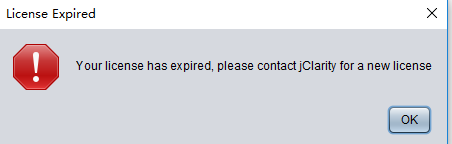

### javac 编译 .java 文件成 .class 文件

byte2Hex，用于打印十六进制表示的 .class 文件
```java
    char[] hex_digits = {
            '0', '1', '2', '3', '4', '5', '6', '7',
            '8', '9', 'a', 'b', 'c', 'd', 'e', 'f'
    };

    char[] bytesToHex( byte[] bytes )
    {
        int bytes_length = bytes.length;
        char[] hex_form = new char[bytes_length*2];
//byte 是8bit, 16进制 4bit
        for( int i = 0, j = 0; i<bytes_length; i++, j=i*2 )
        {
            hex_form[j] 	= hex_digits[ ( bytes[i] & 0xf0 ) >>> 4 ];
            hex_form[j+1]  	= hex_digits[ ( bytes[i] & 0x0f ) ];
        }

        return hex_form;
    }
```
实例代码 HelloWorld.java
```java
public class HelloWorld {
    public HelloWorld() {
    }

    private int hello() {
        return 3;
    }

    public static void main(String[] args) {
        System.out.println("Hello World");
        System.out.println((new HelloWorld()).hello());
    }
}
```
实际的.class文件
```
00000000: cafe babe 0000 0034 002a 0a00 0900 1909  .......4.*......
00000010: 001a 001b 0800 1c0a 001d 001e 0700 1f0a  ................
00000020: 0005 `0019` 0a00 0500 200a 001d 0021 0700  ........ ....!..
00000030: 2201 0006 3c69 6e69 743e 0100 0328 2956  "...<init>...()V
00000040: 0100 0443 6f64 6501 000f 4c69 6e65 4e75  ...Code...LineNu
00000050: 6d62 6572 5461 626c 6501 0012 4c6f 6361  mberTable...Loca
00000060: 6c56 6172 6961 626c 6554 6162 6c65 0100  lVariableTable..
00000070: 0474 6869 7301 0016 4c68 6173 6873 746f  .this...Lhashsto
00000080: 7265 2f48 656c 6c6f 576f 726c 643b 0100  re/HelloWorld;..
00000090: 0568 656c 6c6f 0100 0328 2949 0100 046d  .hello...()I...m
000000a0: 6169 6e01 0016 285b 4c6a 6176 612f 6c61  ain...([Ljava/la
000000b0: 6e67 2f53 7472 696e 673b 2956 0100 0461  ng/String;)V...a
000000c0: 7267 7301 0013 5b4c 6a61 7661 2f6c 616e  rgs...[Ljava/lan
......
```

### 查看 .class 文件的关于类的信息使用 javap 命令
```
  -help  --help  -?        输出此用法消息
  -version                 版本信息
  -v  -verbose             这个可以看到详细信息
  -l                       输出行号和本地变量表
  -public                  仅显示公共类和成员
  -protected               显示受保护的/公共类和成员
  -package                 显示程序包/受保护的/公共类
                           和成员 (默认)
  -p  -private             显示所有类和成员
  -c                       对代码进行反汇编
  -s                       输出内部类型签名
  -sysinfo                 显示正在处理的类的
                           系统信息 (路径, 大小, 日期, MD5 散列)
  -constants               显示最终常量
  -classpath <path>        指定查找用户类文件的位置
  -cp <path>               指定查找用户类文件的位置
  -bootclasspath <path>    覆盖引导类文件的位置
  ```
  通过 javap -p -s HelloWorld 可以得到
  ```
  Compiled from "HelloWorld.java"
public class hashstore.HelloWorld {
  public hashstore.HelloWorld();
    descriptor: ()V //返回类型是void V

  private int hello();
    descriptor: ()I //返回类型是int I

  public static void main(java.lang.String[]);
    descriptor: ([Ljava/lang/String;)V //L 引用类型，[表示数组
}
  ```
### 修改字节码实战 参考 [破解 Java 系软件入门](https://juejin.im/post/5cec8748e51d4550bf1ae7e6 "悬停显示")

修改分析 GC 日志的桌面端软件 [censum](censum-full.jar "悬停显示") 的过期时间



定位到 censum-full.jar!\com\jclarity\censum\CensumStartupChecks.class 里面，使用 ``jdgui``
```java
  private static int getYear()
  {
    return 2016;
  }
  if (currentDate.after(expiryDate)) {
      return CanLoadState.LICENSE_EXPIRED;
    }
```
过期逻辑比较简单，只要超过 2016 年某月某日，软件就过期了，正常地只要修改2016(07e0)为一个更大的数即可, 简单地修改为 08e0 即 2272, 这时 ``censum`` 就可以直接打开了
```java
  private static int getYear()
  {
    return 2272;
  }
  ```
可以使用 zip 直接解压缩 jar 文件, 也可以使用 jar 命令
```
jar -xvf xxx.jar //解压
jar -cvfM xxx.jar * //压缩
```
jar 命令

参数  | 说明|
--------- | --------|
-c  | 创建一个jar包 |
-t  | 显示jar中的内容列表 |
-x  | 解压jar包 |
-u  | 添加文件到jar包中 |
-f  | 指定jar包的文件名 |
-v | 输出详细报告 |
-m  | 指定MANIFEST.MF文件 |
-0  | 生成jar包时不压缩内容 |
-M  | 不生成清单文件MANIFEST.MF |
-i | 为指定的jar文件创建索引文件 |
-C | 可在相应的目录下执行命令 |

