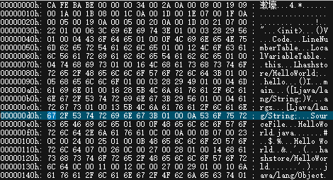

### javac 编译 .java 文件成 .class 文件

byte2Hex
```java
    char[] hex_digits = {
            '0', '1', '2', '3', '4', '5', '6', '7',
            '8', '9', 'a', 'b', 'c', 'd', 'e', 'f'
    };

    char[] bytesToHex( byte[] bytes )
    {
        int bytes_length = bytes.length;
        char[] hex_form = new char[bytes_length*2];
//byte 是8bit, 16进制 4bit
        for( int i = 0, j = 0; i<bytes_length; i++, j=i*2 )
        {
            hex_form[j] 	= hex_digits[ ( bytes[i] & 0xf0 ) >>> 4 ];
            hex_form[j+1]  	= hex_digits[ ( bytes[i] & 0x0f ) ];
        }

        return hex_form;
    }
```
实例代码 HelloWorld.java
```java
public class HelloWorld {
    public HelloWorld() {
    }

    private int hello() {
        return 3;
    }

    public static void main(String[] args) {
        System.out.println("Hello World");
        System.out.println((new HelloWorld()).hello());
    }
}
```
实际的.class文件



### 查看.class文件的关于类的信息使用 javap 命令
```
  -help  --help  -?        输出此用法消息
  -version                 版本信息
  -v  -verbose             这个可以看到详细信息
  -l                       输出行号和本地变量表
  -public                  仅显示公共类和成员
  -protected               显示受保护的/公共类和成员
  -package                 显示程序包/受保护的/公共类
                           和成员 (默认)
  -p  -private             显示所有类和成员
  -c                       对代码进行反汇编
  -s                       输出内部类型签名
  -sysinfo                 显示正在处理的类的
                           系统信息 (路径, 大小, 日期, MD5 散列)
  -constants               显示最终常量
  -classpath <path>        指定查找用户类文件的位置
  -cp <path>               指定查找用户类文件的位置
  -bootclasspath <path>    覆盖引导类文件的位置
  ```
  通过 javap -p -s HelloWorld 可以得到
  ```
  Compiled from "HelloWorld.java"
public class hashstore.HelloWorld {
  public hashstore.HelloWorld();
    descriptor: ()V //返回类型是void V

  private int hello();
    descriptor: ()I //返回类型是int I

  public static void main(java.lang.String[]);
    descriptor: ([Ljava/lang/String;)V //L 引用类型，[表示数组
}
  ```
